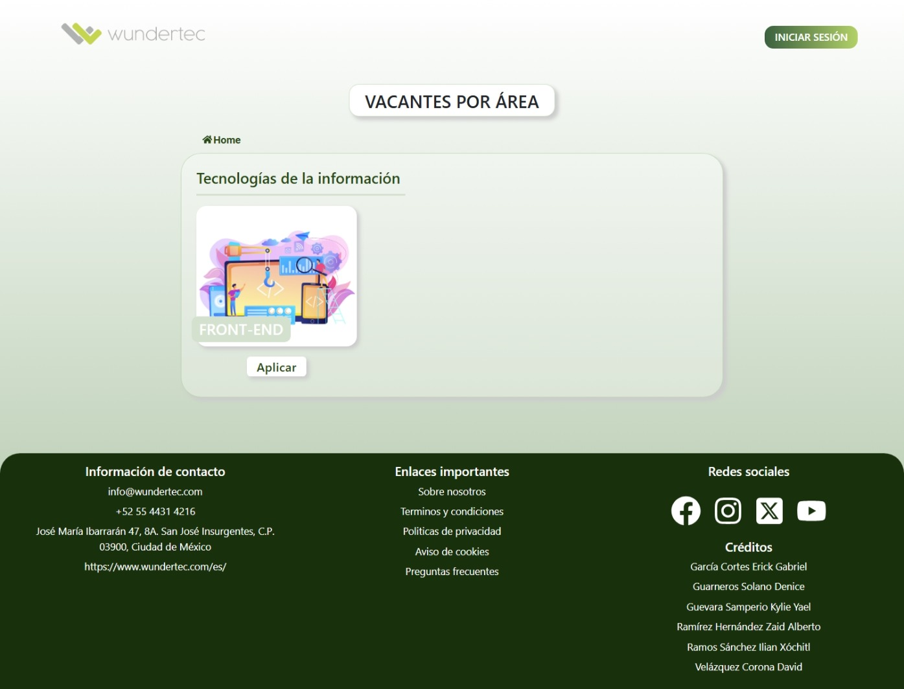
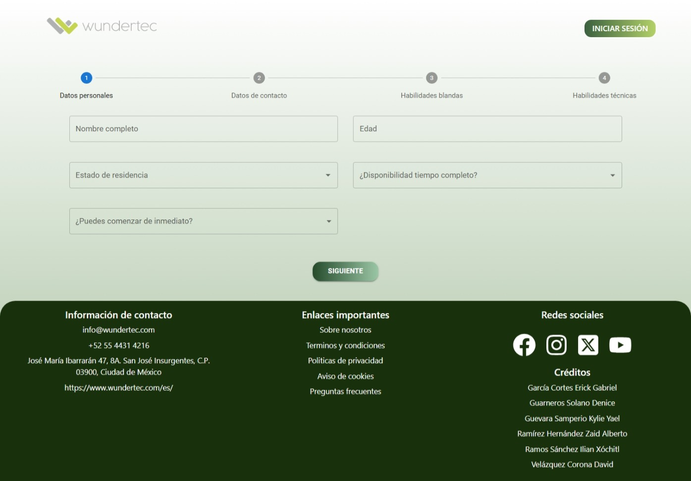
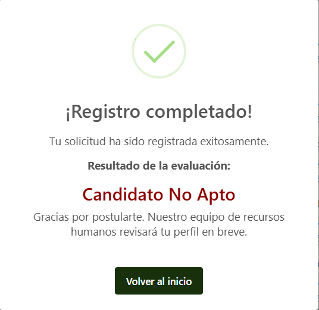
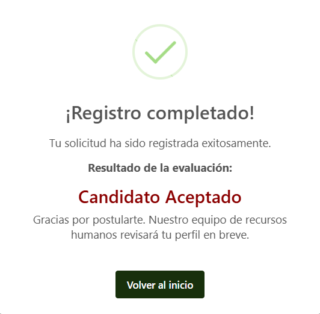
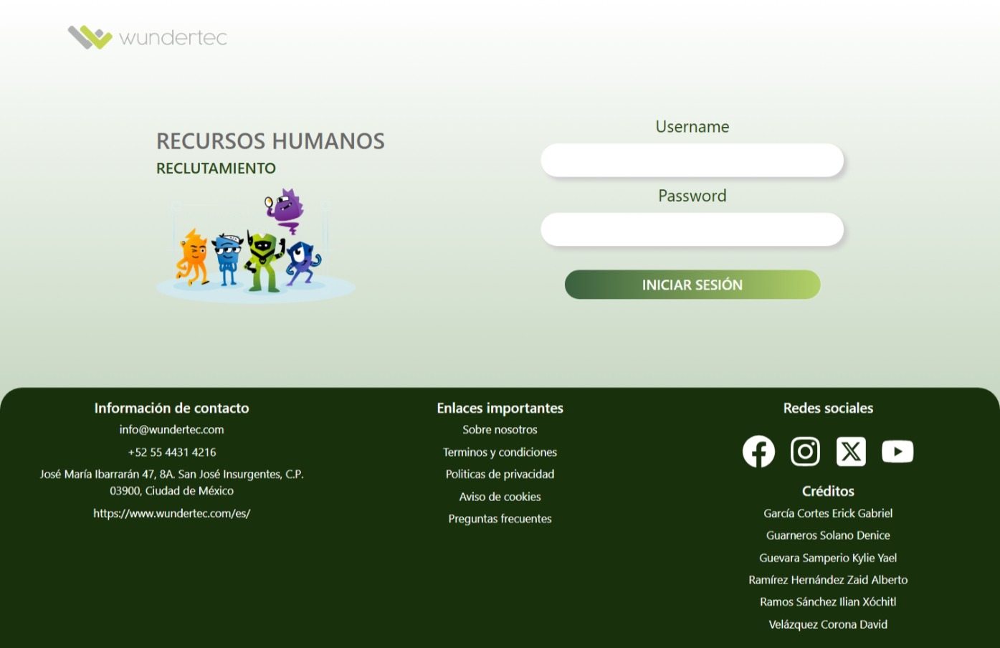
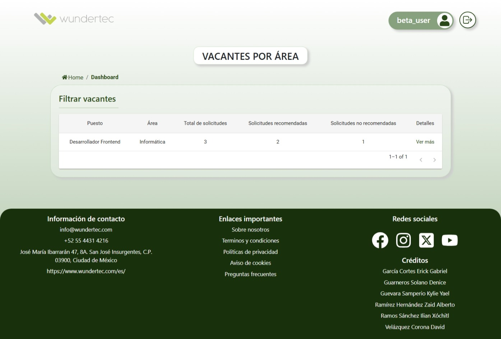

# 🧠 PT Smart Hiring Platform

Este proyecto es una plataforma de contratación inteligente que utiliza **Machine Learning** para sugerir el puesto más adecuado a los candidatos, basado en su perfil y respuestas.  
Está desarrollado con:

- 🖥️ Frontend: React + Vite
- ⚙️ Backend: FastAPI + SQLAlchemy + Alembic
- ☁️ Despliegue: AWS
- 🧠 ML: Python (scikit-learn / pandas / etc.)

## 📁 Estructura del proyecto
```
PT-smart-hiring-platform/
│
├── front-end/ # React + Vite
│ ├── src/
│ ├── public/
│ └── ...
│
├── back-end/ # FastAPI + SQLAlchemy + ML
│ ├── app/
│ │ ├── main.py
│ │ ├── models/
│ │ ├── routes/
│ │ ├── database/
│ │ └── ml/
│ ├── venv/
│ └── ...
│
└── README.md
```

## 🧪 Requisitos

Asegúrate de tener instalado:

- [Node.js](https://nodejs.org/) v16+
- [Python](https://www.python.org/downloads/) v3.9+
- [Git](https://git-scm.com/)
- [pip](https://pip.pypa.io/)
- [virtualenv](https://pypi.org/project/virtualenv/)


## 🚀 Instalación

### 🔧 Clona el repositorio

```bash
git clone https://github.com/ZaidHernandezDev/PT-smart-hiring-platform.git
cd PT-smart-hiring-platform
```

---

### ⚛️ Instalar el Frontend

```bash
cd front-end
npm install
npm run dev
```

Esto levanta el frontend en http://localhost:5173

---

📚 Recursos y Documentación

Aquí puedes encontrar más información sobre las librerías utilizadas en este proyecto:

- [@mui/material](https://mui.com/material-ui/getting-started/)
- [Bootstrap](https://getbootstrap.com/docs/)
- [Motion](https://motion.dev/)
- [React Hook Form](https://react-hook-form.com/)
- [React Icons](https://react-icons.github.io/react-icons/)
- [React Toastify](https://fkhadra.github.io/react-toastify/introduction/)
- [Styled Components](https://styled-components.com/docs)
- [SweetAlert2](https://sweetalert2.github.io/)
- [SweetAlert2 React Content](https://github.com/sweetalert2/sweetalert2-react-content)
- [Yup](https://github.com/jquense/yup)

Estos enlaces te ayudarán a entender y aprovechar al máximo las herramientas que estás usando en este proyecto.

---

### 🐍 Instalar el Backend

Si estamos dentro de la carpeta `front-end` necesitamos cambiar a la carpeta `back-end` con el siguiente comando

```bash
cd ../back-end
```


**Requisitos previos**

- Tener Python 3.8+ instalado.

- Si estás en Windows, es posible que necesites configurar la política de ejecución de PowerShell para permitir la activación del entorno virtual. Abre PowerShell como Administrador y ejecuta:

```
Set-ExecutionPolicy -ExecutionPolicy RemoteSigned
```
Escribe Y y presiona Enter para confirmar.

**Crear entorno virtual**

```bash
python -m venv venv
```

**Activar entorno virtual**

- En PowerShell: `venv\Scripts\Activate.ps1`

- En cmd: `venv\Scripts\activate.bat`

- En Unix/macOS: `source venv/bin/activate`

**Instalar dependencias**

Las dependencias necesarias ya están listadas en el archivo `requirements.txt`, por lo que basta con ejecutar:

```bash
pip install -r requirements.txt
```

Luego puedes correr el backend con:

```bash 
uvicorn app:app --reload
```

Esto levanta el backend en http://localhost:8000

## Imágenes sobre las vistas de la aplicación

**Vista de inicio**



**Vista de formulario**



**Vista de usuario aceptado**



**Vista de usuario no aceptado**



**Vista de login**



**Vista de dashboard**


